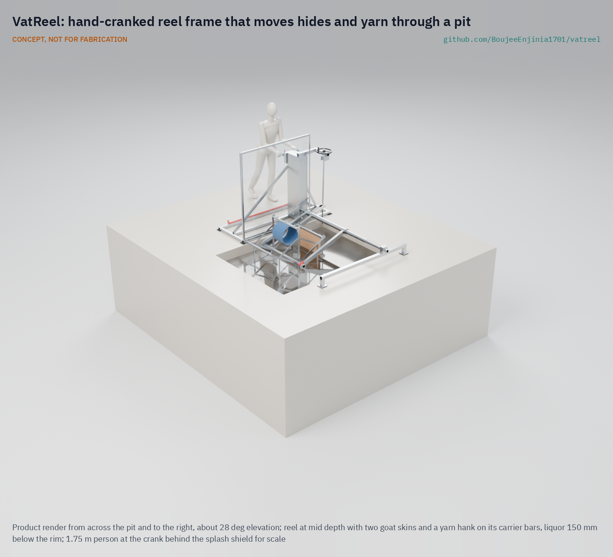
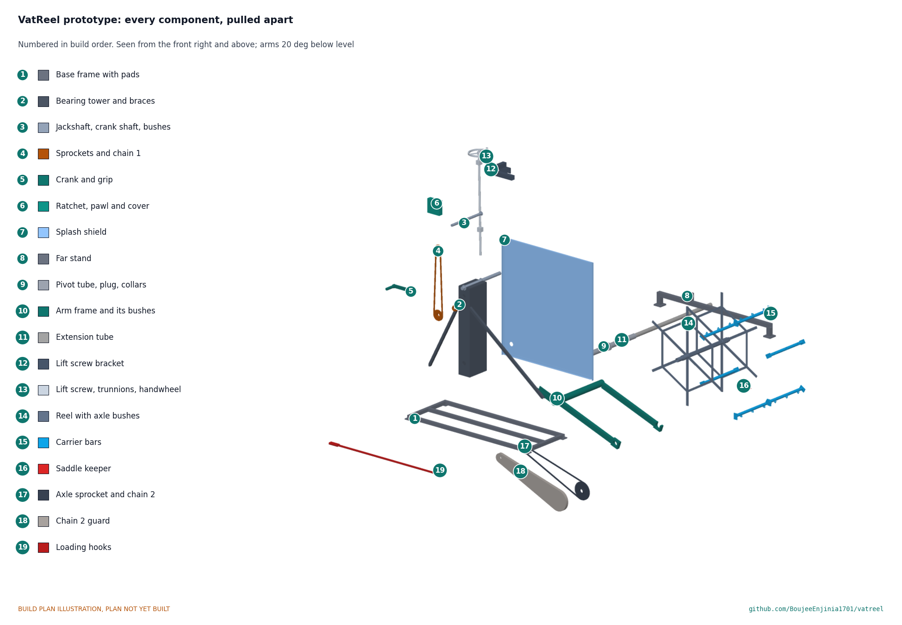

# VatReel

     

**Area:** Advanced manufacturing · **TRL:** 3 of 9 (proof of concept on paper) · **Value-engineering target:** $1,500 USD · **Difficulty:** 2 of 5

Moves hides and yarn through pits and dye vats on a hand-cranked reel so hands never enter the liquor.

> CONCEPT, NOT FOR FABRICATION. VatReel is a TRL 3 design on paper: it has not been built or tested.

[Concept render](media/hero.png) · [Exploded view](media/exploded.png) · [Interactive 3D model](media/viewer.html) · [Concept blueprint (PDF)](media/concept-blueprint.pdf) · [General arrangement VTR-DWG-001 (PDF)](cad/drawings/VTR-DWG-001.pdf) · [Sizing note VTR-CAL-001](docs/04-calcs/01-sizing.md) · [Prototype build plan](docs/05-build-plan.md) · [Design decisions](docs/06-design-decisions.md) · [Review note](docs/REVIEW.md)

## Concept rationale

The liquor is the hazard, and the hands are the route in. Industrial dye houses solved this long ago with the winch, a reel that lifts cloth in and out of the bath, but those machines are fixed, powered and sized for factories. VatReel keeps the reel and drops everything else: a portable frame set across an existing pit or vat, a hand crank, and carriers that hold hides or hanks of yarn. The worker loads dry-side, cranks, and the reel carries the load through the liquor.

It is meant for workshops that will not buy a drum or a dyeing machine. The frame spans the pits they already have, it is built from stock sections and corrosion-resistant sheet, and every part can be cut, drilled and bolted with hand tools. Publishing it openly lets a local fabricator build it and a cooperative adapt it to its own pit sizes.

## Burning platform

In Hazaribagh, Dhaka, Human Rights Watch counted about 150 tanneries and 8,000 to 12,000 workers, and recorded workers climbing into pits to pull hides out by hand; one described acid falling on a colleague's arm so that the flesh came off ([HRW, 2012](https://www.hrw.org/report/2012/10/09/toxic-tanneries/health-repercussions-bangladeshs-hazaribagh-leather)). In Kanpur, India, tannery workers with moderate or high skin contact with chemicals were 35 times more likely to report scaling with fissures than those with low exposure, and 22 % of tannery workers reported itching and fissured hands against 7.3 % of other workers ([Kashyap et al., 2021](https://pmc.ncbi.nlm.nih.gov/articles/PMC8530047)).

The dose is not only on the skin. Among 120 tannery workers in Sialkot, Pakistan, 54 % had blood chromium above the ATSDR safety threshold and 13 % had skin rashes ([Khan et al., 2013](https://journals.sagepub.com/doi/10.1177/0748233711430974)). In hand dyeing, the UK Health and Safety Executive notes that some dyes cause allergic skin reactions and that harsh cleaning to remove colour from skin can itself cause dermatitis ([HSE](https://www.hse.gov.uk/textiles/dyes-dyeing.htm)).

## Where it could be used

### By industry

| Industry | Use |
| --- | --- |
| Small and informal tanneries | Moving hides through soaking, liming, pickling and tanning pits without workers entering or reaching into the liquor |
| Hand and craft dyeing | Carrying hanks of yarn or lengths of cloth through hot or indigo vats at an even pace |
| Heritage and tourist workshops | Keeping traditional pit processes while taking the worker's body out of the bath |
| Leather and textile supply chains | A low-cost engineering control that brands and auditors can point small suppliers to |
| Vocational and technical colleges | Teaching model for reel, gear and corrosion design in wet process industries |

### By country or region

| Country or region | Why it matters there |
| --- | --- |
| Bangladesh | Hazaribagh workers told Human Rights Watch they climb into pits and lift hides out by hand while liquor splashes their skin ([HRW, 2012](https://www.hrw.org/report/2012/10/09/toxic-tanneries/health-repercussions-bangladeshs-hazaribagh-leather)). |
| India | In Kanpur, 18 % of tannery workers reported scaling with fissures on the hands, against 3.8 % of non-tannery workers ([Kashyap et al., 2021](https://pmc.ncbi.nlm.nih.gov/articles/PMC8530047)). |
| Pakistan | More than half of the Sialkot tannery workers studied had blood chromium above the ATSDR threshold ([Khan et al., 2013](https://journals.sagepub.com/doi/10.1177/0748233711430974)). |
| Morocco | At the Chouara tannery in Fez, about 200 men work, standing thigh-deep in chromium-laden vats to move hides ([Living on Earth](https://www.loe.org/shows/segments.html?programID=14-P13-00044&segmentID=4)). |
| Nigeria | Dyers at Kano's Kofar Mata pits, traced back more than 500 years, still dip cloth again and again into deep in-ground vats of fermented indigo ([Wikipedia](https://en.wikipedia.org/wiki/Kofar_Mata_Dye_Pits)). |

## What sparked the idea

The idea came from a single line in the Human Rights Watch report on Hazaribagh. A worker described how the job is done: they get inside the pit, take the hides with their hands and throw them out, and even with gloves and boots the water splashes on their skin. Another recalled acid falling on a colleague's arm until the bone showed ([HRW, 2012](https://www.hrw.org/report/2012/10/09/toxic-tanneries/health-repercussions-bangladeshs-hazaribagh-leather)). The hazard comes from a hand task that a crank and a reel could do instead.

## Problem

In small tanneries and hand-dyeing workshops, workers reach, wade or stand in pits of acid, chromium and dye liquor to move hides and yarn through the bath. Their skin takes the dose every shift.

Full problem statement: [docs/01-problem.md](docs/01-problem.md)

## Concept

A portable hand-cranked reel frame set across a tannery pit or dye vat; workers load hides or yarn onto the reel and crank it to carry them through the liquor, so their hands never enter the bath. A stainless frame spans pits 1.0 to 2.5 m wide; the reel rides on two arms that swing on a pivot tube across the pit, and a self-locking lift screw sets how deep it dips (the lowest carrier bar 0.3 to 1.0 m below the rim) or lifts it clear. Every carrier bar comes up above the rim to be loaded with long hooks from behind a splash shield. On paper the crank needs about 90 N with a 25 kg wet load on one bar, and the parts cost about $1,437 against the $1,500 value-engineering target.

Full design precis: [docs/02-concept.md](docs/02-concept.md) · Requirements: [docs/03-requirements.md](docs/03-requirements.md)

## Key components

- Near stand (base frame and bearing tower) and far stand, joined by a telescopic pivot tube
- Arm frame swinging on the pivot tube
- Reel with six carrier bars and snap hooks
- Hand crank with a two-stage roller chain drive, 6 to 1, fully enclosed
- Ratchet and pawl brake
- Self-locking lift screw with a handwheel (in place of a lift lever)
- Splash shield
- Loading hooks

## Building the prototype

The [prototype build plan](docs/05-build-plan.md) (VTR-BLD-001, plan, not yet built) shows how to make each component and fit it to the next, in 16 making sketches, 11 joint close-ups and 13 assembly steps drawn from the model. The frame, arms and reel are sawn, drilled and welded from 304 and 316L stainless tube, bar and plate, with no casting or lathe work; the chains, sprockets, bushes and lift screw are bought. Writing the plan made the design constructable: eighteen changes, such as a torque tube joining the arms, a closed chain guard and an open saddle that lets the reel drop in without anyone reaching over the pit, are recorded in [VTR-DDR-002](docs/decisions/0002-design-for-construction.md). The parts cost about $1,437, $63 under the $1,500 value-engineering target, a hypothetical control target.

## Safety

> Published as an open engineering reference, not certified equipment. Builders and users are responsible for their own risk assessment.
>
> The reel reduces skin contact but does not remove the need for gloves, eye protection and boots.
>
> Nip points at the crank gear and reel must be guarded; loose clothing and long hair must be kept clear.
>
> The frame must not create a trip or fall hazard at the pit edge; the pit rim must be checked before placing the stands.
>
> Hot baths near 98 °C (208 °F) add a scald hazard; the splash shield and the self-locking lift are part of the design, not options, and two people are present at any bath above 60 °C.
>
> The reel and its load (up to about 55 kg) hang over the pit; the lift screw is self-locking and the ratchet holds the reel, and the chains, sprockets and ratchet are enclosed. Never reach toward the reel unless it is stopped, the ratchet is engaged and the arms are wound up. The build plan lists the safety stops (VTR-BLD-001, section 6).
>
> This design is published as an open engineering reference. It is not certified equipment.

## Repository layout

| Folder | Contents |
| --- | --- |
| `docs/` | Problem, concept, requirements, calculations and design decisions |
| `cad/src/` | build123d Python source, the source of truth for all geometry |
| `cad/step/`, `cad/stl/` | Exported models for FreeCAD, other CAD tools and printing |
| `cad/drawings/` | 2D sketches and dimensioned drawings |
| `bom/` | Bill of materials |
| `electronics/` | KiCad schematics and PCB layouts |
| `firmware/` | Microcontroller code |
| `media/` | Renders, perspectives and photos |
| `build-log/` | Dated prototyping notes |

## Documentation

Controlled documents follow the portfolio [documentation standard](.kit/STANDARDS.md). Each carries a document ID (VTR-PRC-001 for the precis), a version and a revision history. Branded PDFs are built with `python .kit/render.py` and attached to GitHub Releases when a document is tagged, for example `VTR-PRC-001/v1.0`.

## Credits

Designed by Amish Chadha at Design Molecule Labs. See [CONTRIBUTORS.md](CONTRIBUTORS.md) for roles. To cite this design, use [CITATION.cff](CITATION.cff) (GitHub shows it as "Cite this repository").

AI assistance (Claude) was used to accelerate prototype documentation and first-pass research. Design direction and all decisions are Amish Chadha's, recorded in this repository's decision records (`docs/decisions/`).

## Licenses

- **Hardware** (CAD, drawings, BOM, electronics): [CERN-OHL-S v2](LICENSE)
- **Software** (firmware, scripts, notebooks): [MIT](LICENSE-SOFTWARE)

A project of [Design Molecule Labs](https://designmolecule.com).
