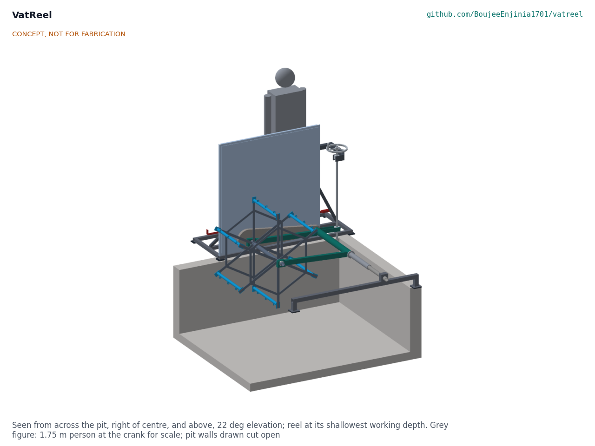
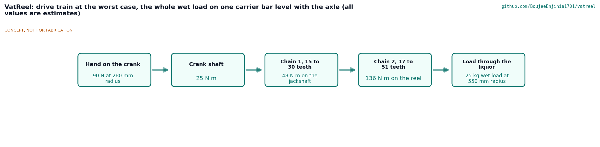
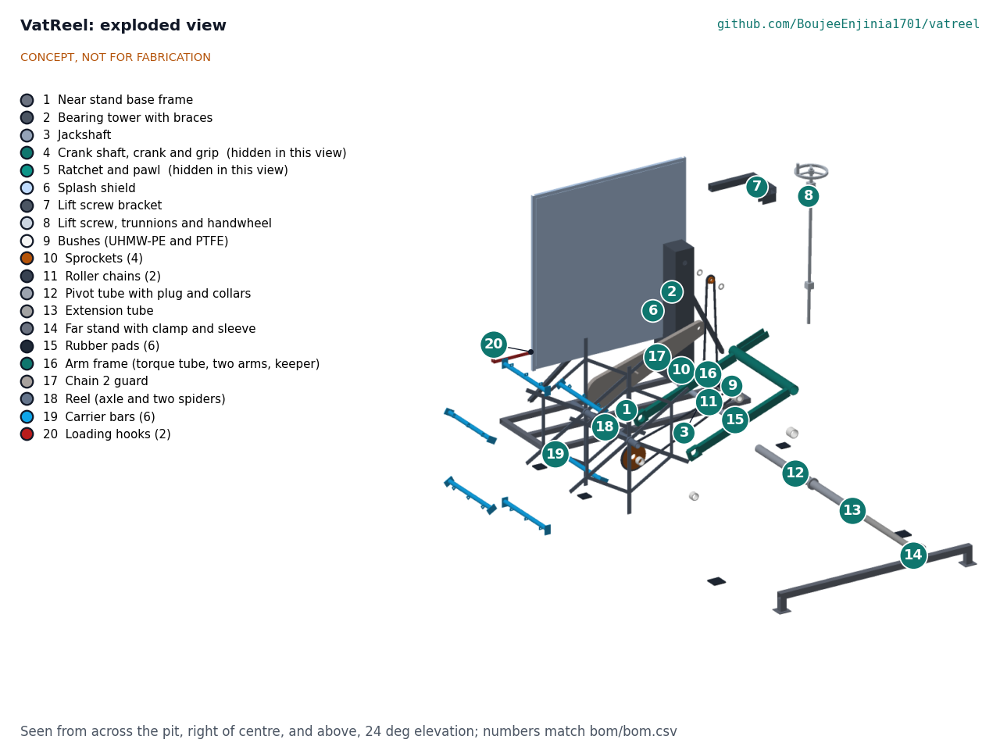

# VatReel design precis

Moves hides and yarn through pits and dye vats on a hand-cranked reel so hands never enter the liquor.

*Figure 1. Concept render from the model: the near stand with its crank and splash shield on the operator's rim, the pivot tube across the pit to the far stand, and the reel on its arms.*

## How it works

A frame sits across the pit from rim to rim: a near stand on the operator's side and a far stand on the opposite rim, joined by a pivot tube that runs across the pit 200 mm above the rim, close to one end wall. Two arms swing on that pivot line and carry the reel at their ends; the reel's axle points across the pit, toward the operator. The operator turns a crank on the near stand, 1.0 m above the floor; two roller chains, the first inside the stand and the second in a closed case along the near arm, turn the reel at one sixth of the crank speed. Hides hang from snap hooks on six carrier bars, and hanks of yarn loop over them; as the reel turns, each bar goes down through the liquor and comes back up above the rim, where it is loaded, drained or unloaded with long hooks from behind a splash shield. A handwheel on a self-locking lift screw sets the arm angle, which sets how deep the reel dips (the lowest bar 300 to 1,000 mm below the rim) and, wound fully up, lifts every bar clear of the rim. A ratchet on the crank shaft holds the reel wherever it stops.

*Figure 2. Drive train at the worst case (estimates, VTR-CAL-001).*

## Components

*Table 1. Components (numbers match bom/bom.csv and the exploded view).*

| # | Component | Role |
| --- | --- | --- |
| 1, 2 | Near stand: base frame and bearing tower | Sits on the operator's rim; carries the crank, both shafts, chain 1 and the lift screw |
| 3, 4, 5 | Jackshaft, crank shaft and crank, ratchet and pawl | Turn and hold the reel |
| 6 | Splash shield | Translucent polypropylene in a stainless frame between the reel and the operator |
| 7, 8 | Lift screw bracket, lift screw, trunnions and handwheel | Set the depth and lift the reel; self-locking |
| 9, 10, 11 | Bushes, sprockets, roller chains | Two-stage 6 to 1 drive |
| 12, 13, 14 | Pivot tube, extension tube, far stand | Span pits 1.0 to 2.5 m wide |
| 16, 17 | Arm frame (torque tube and two arms), chain 2 guard | Carry the reel and enclose chain 2 |
| 18, 19 | Reel (axle and two spiders), carrier bars with snap hooks | Carry the load through the liquor |
| 15, 20, 22 | Rubber pads, loading hooks, assembly bar | Footing, hands-off loading, carrying the reel |

*Figure 3. Exploded view with BOM numbers.*

## Key design choices

All were decided on 2026-10-03 under Amish's pre-approval and are recorded in VTR-DDR-001 (TRL 2) and VTR-DDR-002 (design for construction); VTR-DEC-001 indexes them.

- **Reel on swinging arms, not on a shaft across the pit.** A shaft spanning 1.0 to 2.5 m pits would have to telescope while turning; instead the static pivot tube telescopes and the reel stays 0.6 m long, close to the operator's rim.
- **Crank at a fixed height.** The first chain runs inside the stand from the crank to a jackshaft on the pivot line, the second along the arm, so the crank stays 1.0 m above the floor at every depth.
- **Self-locking lift screw in place of a free lift lever.** The reel and load weigh up to 55 kg; a screw cannot let them drop into a hot bath, and holds at any height.
- **Stainless throughout:** 316L for everything that goes into the liquor, 304 for the frame; glass-filled PTFE bushes in the liquor and UHMW-PE above it.
- **Everything moving is enclosed** except the reel itself, which is in the pit: chain 1 and the ratchet inside the stand, chain 2 in a closed case.

## First-order numbers

*Table 2. Key figures (estimates from VTR-CAL-001).*

| Quantity | Value | Assumption |
| --- | --- | --- |
| Reel | 1.18 m over the spokes, 0.6 m long, six bars at 550 mm radius | |
| Lowest bar below the rim | 300 to 1,000 mm, any depth between | Liquor 150 mm below the rim |
| Pits served | 1.0 to 2.52 m wide, at least 1.89 m long | Pivot 350 mm in from the end wall |
| Crank force | 90 N | 25 kg wet load all on one bar, level with the axle |
| Reel speed | 5 rpm, bars at 0.29 m/s | 30 rpm at the crank |
| Lift screw | 63 turns end to end, 79 N at the handwheel at 1.5 x | Thread friction 0.15 |
| Mass | 171 kg in all; heaviest carry 29.6 kg by two people | Model solids |
| Parts cost | USD 1,437 | Value-engineering target USD 1,500; USD 63 under |

## Patent design-arounds

From the preliminary patent, trademark and prior-art screen (not legal advice):

- Portable, manual version of the public-domain winch beck; the closest patent found, US3513672A, has expired.
- Watch items from the preliminary screen: corrosion of wetted parts and crank load. Both are addressed in VTR-CAL-001 (R6 at risk until coupon tests; crank force 90 N).

## Shared blocks

- The proposed hand capstan common block (SaltDrag, SiltHaul) is not used: the reel rises and falls, so VatReel needs its own two-stage chain drive (VTR-DDR-001).
- CalRig is the first candidate for the R5 proof-load test at TRL 4.

## Safety

> **Safety:** Published as an open engineering reference, not certified equipment. Builders and users are responsible for their own risk assessment.
>
> **Hazards.** Corrosive liquors (lime, sulphides, acids, chromium salts) and, in dyeing, baths near 98 °C (208 °F) that scald; an open pit edge with wet floors; moving machinery (the reel, two roller chains, a ratchet and a lift screw); a 55 kg reel and load hanging over the pit; lifts of up to 30 kg by two people during setup.
>
> **What the design does about them.** Hands stay out of the liquor: every bar comes up above the rim to be loaded with long hooks. The splash shield stands between the reel and the operator. The chains, sprockets and ratchet are enclosed. The lift screw is self-locking and the ratchet holds the reel, so nothing falls when the handwheel or crank is let go. The stands sit back from the pit edge on rubber pads.
>
> **What the user must still do.** Wear gloves, eye protection and boots; keep loose clothing and long hair clear of the crank; never reach over the shield or into the pit while the reel can turn; do not work alone at a hot bath; check the pit rim before placing the stands. The shield is not a guardrail.
>
> This design is published as an open engineering reference. It is not certified equipment.

## Next step

TRL 3 is reached on paper. The recommended next step, when the portfolio phase allows it, is TRL 4: build the prototype to VTR-BLD-001 and test it on a water-filled tank, then with the first co-design partner.
