# VatReel prototype build plan

**Plan, not yet built.** How to build the first proof-of-concept prototype, component by component. Building and testing to it is TRL 4 work. Decisions are kept in the design decisions register ([docs/06-design-decisions.md](06-design-decisions.md)), not here.

## 1. What you are building

*Figure 1. Every component pulled apart and numbered in build order.*

The prototype is a hand-cranked reel on a stainless frame that sits across a tannery pit or dye vat. A near stand on the operator's rim carries the crank, the drive and a splash shield; a pivot tube runs across the pit to a far stand on the opposite rim; two arms swing on the pivot tube and carry a reel with six carrier bars down into the liquor; a handwheel on a lift screw sets how deep the reel goes. Figure 1 shows the 19 groups of parts in the order you make or fit them. The work is sawing, drilling and TIG or stick welding stainless tube, bar, plate and sheet; cutting a polypropylene sheet; bending a sheet strip by hand; and fitting bought parts (chains, sprockets, bushes, the lift screw and nut, a handwheel, snap hooks). There is no casting and no lathe work. The parts cost about USD 1,437 from the bill of materials.

> **Safety:** VatReel is moving machinery used beside an open pit of corrosive and, for dyeing, hot liquor. Its build involves welding stainless steel (fume with chromium and nickel: weld outdoors or with extraction), grinding, lifts of up to 30 kg by two people over a pit edge, and a 55 kg reel and load hanging over the pit. Work only from the rims; never stand on boards or the frame over the pit. Fit and test over an empty pit or a water-filled tank before any liquor; section 6 lists the points where work stops.

## 2. What changed to make it buildable

The concept showed what VatReel does; some of its parts could not be made or fitted as drawn. Each change keeps what VatReel does and is recorded in decision record VTR-DDR-002.

*Table 1. Changes from the concept.*

| Component | The concept had | The buildable design has | Why |
| --- | --- | --- | --- |
| Arm frame | Two arms joined by a thin tie tube | Both arms welded to a torque tube round the pivot line (Figure 19) | The tie would have bent at about 280 MPa; the tube twists at 29 MPa |
| Sprockets | 12 teeth on 30 and 40 mm shafts | 15/30 and 17/51 teeth, still 6 to 1 | A 12-tooth sprocket cannot be bored that large |
| Chain 2 guard | A flat plate | A closed case round the chain (Figure 20) | No open edges near the chain |
| Bearing tower | Open bottom, ratchet exposed | Bottom sheet; ratchet cover with the release lever outside (Figure 8) | Close the chain box and the pawl |
| Far bearing | A bolted split block | An open saddle with a keeper (Figure 23) | It is 0.9 m into the pit; the reel drops in from above |
| Pivot tube support | A bracket round the sprocket | A plug riding on the jackshaft tip (Figure 6) | No bracket can pass the sprocket and the arm |
| Pivot tube reach | One telescopic tube | Pivot tube plus a pinned extension and a clamped far stand (Figure 17) | Spans 1.0 to 2.52 m |
| Splash shield | 1.12 m wide from 260 mm up | 1.32 m wide from 60 mm up, hole for the jackshaft (Figure 11) | Every sight line from the reel to the eye is blocked |
| Base frame | 1.55 m long | 1.75 m long | Carries the wider shield |
| Tower braces | Welded on | Bolted on, lowered | Tower 23.2 kg to carry; clears the ratchet cover |
| Reel | Spokes on the axle, bars welded | Spokes on hub sleeves with hexagon ties; bars bolted with end plates (Figures 21 and 25) | Jig-welded square; bars replaceable |
| Reel fitting | Not worked out | An assembly bar through the hollow axle, carried by two people on opposite rims | No one reaches over the pit |

## 3. Making the components

Make and check each component before the step that needs it. Sizes are in millimetres. "Near" is the operator's rim; "far" is the opposite rim; "along the pit" is the direction the reel turns in. Workshop tolerance is 1 mm unless a step says otherwise. Weld stainless with 316L filler (TIG, or stick with 316L electrodes), and pickle the welds of every part that goes into the liquor. Mark every part with its name in paint marker as you make it.

### 3.1 Near stand base frame

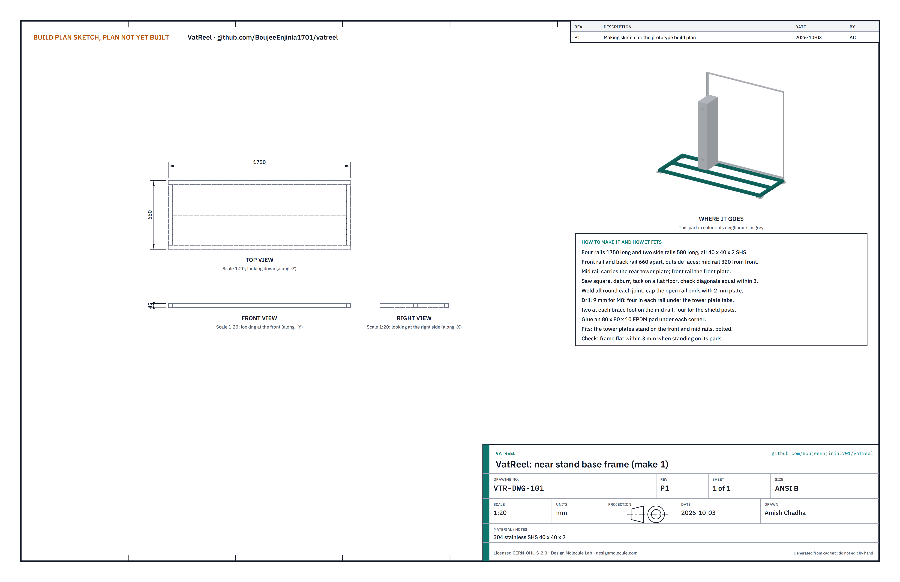

*Figure 2. Base frame making sketch (VTR-DWG-101).*

**What it is and what it is made from.** The rectangle that sits on the operator's rim and carries the tower and shield. 304 stainless square tube 40 x 40 x 2; four EPDM pads 80 x 80 x 10.

**How to make it.**

1. Saw three rails 1,750 long (front, mid and back) and two side rails 580 long; deburr.
2. Lay them out on a flat floor: front and back rails 660 apart outside, the mid rail 320 behind the front rail's centre line, side rails at the ends. Check the diagonals are equal within 3.
3. Tack, recheck, then weld all round each joint. Cap the open ends with 2 mm plate.
4. Drill 9 mm holes for M8: two under each tower plate tab on the front and mid rails, two at each brace foot on the mid rail, two under each shield post on the front rail.
5. Glue a pad under each corner.

**How it fits the parts next to it.** The front tower plate stands on the front rail and the rear plate on the mid rail, each with two M8 bolts (Figure 3). The shield posts bolt to the front rail.

**Check before moving on.** The frame stands flat on its pads within 3 mm.

### 3.2 Bearing tower and braces

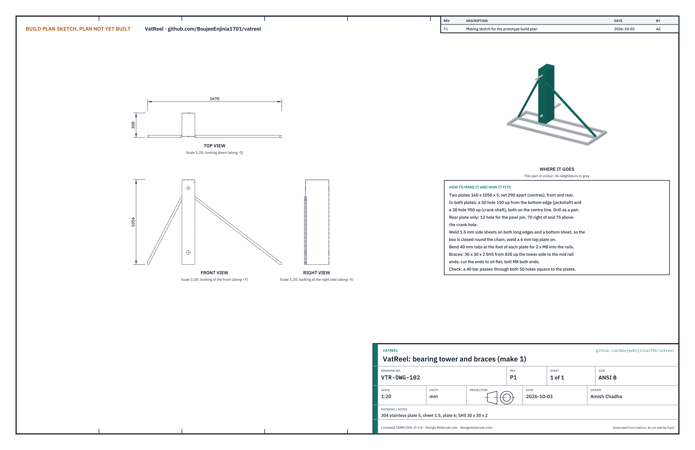

*Figure 3. Bearing tower making sketch (VTR-DWG-102).*

**What it is and what it is made from.** A closed box that carries both shafts in bushes and encloses chain 1. Two 304 plates 160 x 1,050 x 5; 1.5 mm side sheets and bottom sheet; a 6 mm top plate; two 30 x 30 x 2 braces.

**How to make it.**

1. Cut the two plates; clamp them together and drill as a pair: a 50 hole on the centre line 150 above the bottom edge (jackshaft, 200 above the rim when standing) and a 38 hole 950 above it (crank shaft, 1,000 above the rim).
2. Rear plate only: a 12 hole for the pawl pin, 70 to the right of and 75 above the crank hole.
3. Bend a 40 mm tab at the foot of each plate with two 9 mm holes matching the rails.
4. Stand the plates 290 apart (centres) on a flat table; weld the side sheets along both long edges and the bottom sheet between them, then the top plate.
5. Braces: saw two lengths of 30 x 30 x 2 to run from 830 up each tower side down to the mid rail end; cut the ends to sit flat; drill both ends 9 mm.

**How it fits the parts next to it.**

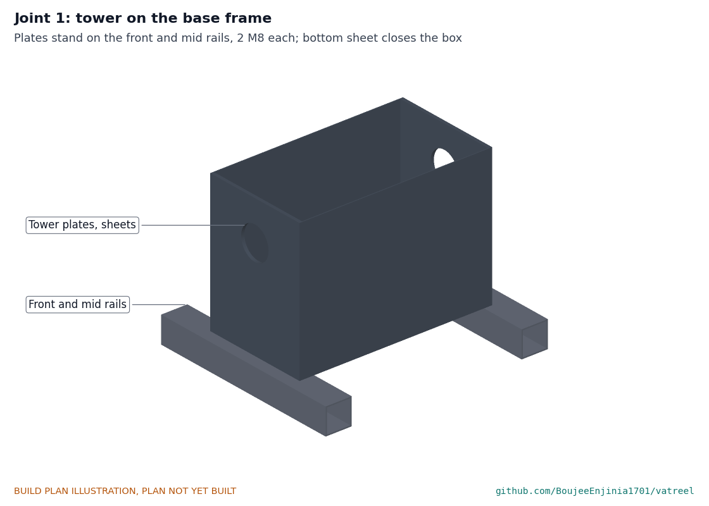

*Figure 4. Joint 1. The plates stand on the front and mid rails, two M8 each; the bottom sheet closes the box.*

**Check before moving on.** A straight 40 bar passes through both 50 holes, square to the plates.

### 3.3 Jackshaft

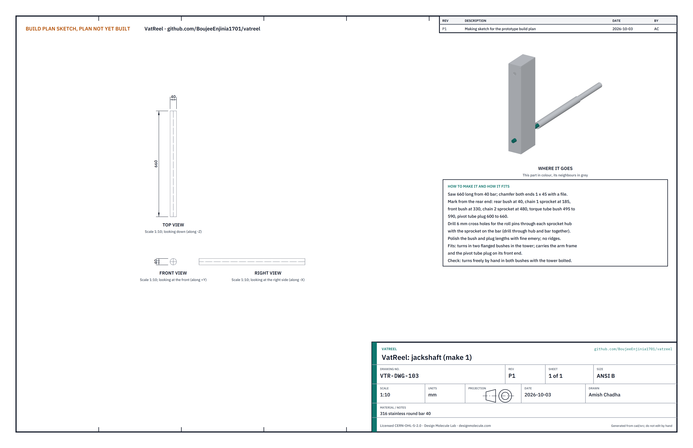

*Figure 5. Jackshaft making sketch (VTR-DWG-103).*

**What it is and what it is made from.** The 40 mm 316 shaft that runs from behind the tower to just over the pit edge. It carries the large chain 1 sprocket, the chain 2 sprocket, the arm frame and the pivot tube's plug.

**How to make it.**

1. Saw 660 long; chamfer both ends with a file.
2. Mark from the rear end: rear bush at 40, large chain 1 sprocket at 185, front bush at 330, chain 2 sprocket at 480, arm frame bush 495 to 590, pivot tube plug 600 to 660.
3. Drill each sprocket's 6 mm roll pin hole through the hub and the shaft together, with the sprocket in place.
4. Polish the bush and plug lengths with fine emery.

**How it fits the parts next to it.**

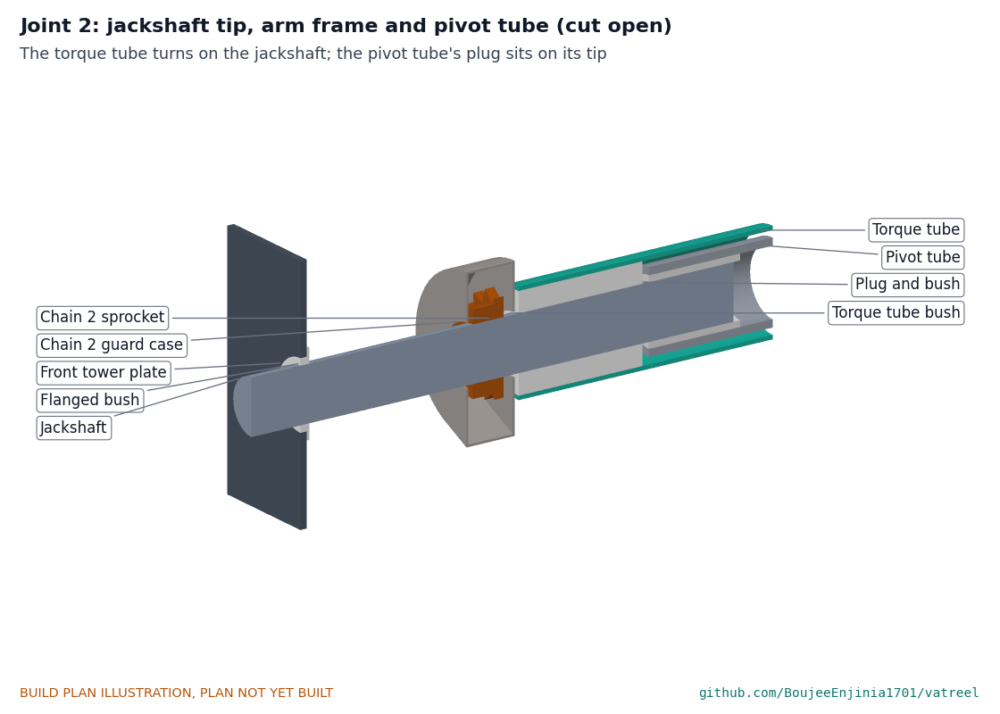

*Figure 6. Joint 2. The torque tube's bush turns on the jackshaft just past the chain 2 case; the pivot tube's plug sits on the tip.*

**Check before moving on.** The shaft turns freely by hand in both tower bushes.

### 3.4 Crank shaft and crank

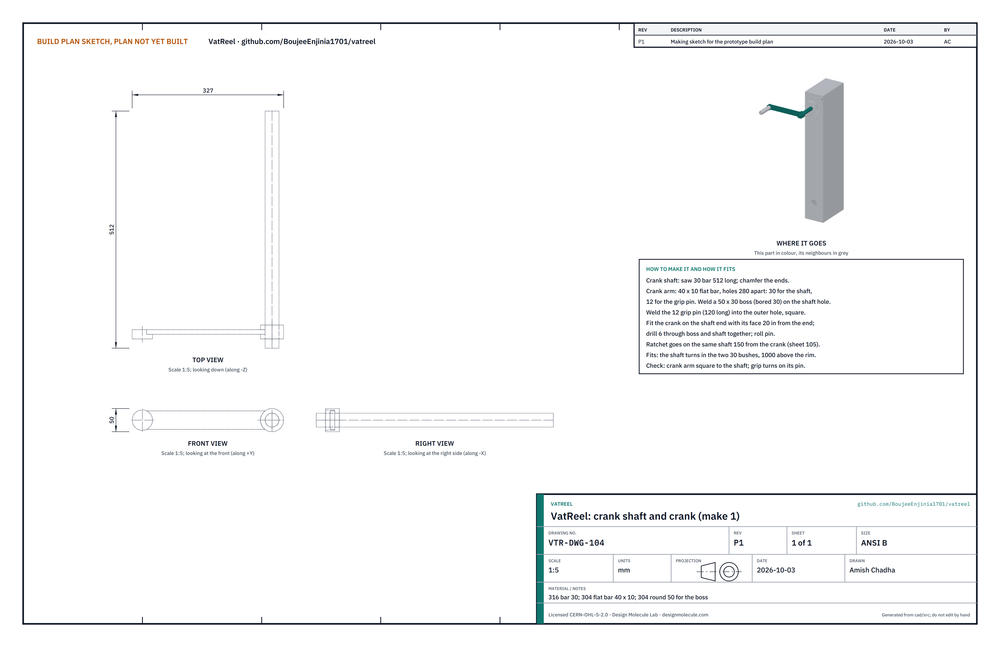

*Figure 7. Crank shaft and crank making sketch (VTR-DWG-104).*

**What it is and what it is made from.** A 30 mm 316 shaft 512 long, a crank arm of 40 x 10 flat bar with 280 between hole centres, and a bought turning grip on a 12 pin.

**How to make it.**

1. Saw and chamfer the shaft.
2. Drill the crank arm 30 and 12 at 280 centres; weld a 50 x 30 boss bored 30 over the shaft hole; weld the 12 pin, 120 long, in the outer hole, square to the arm.
3. Slide the crank onto the shaft, its face 20 in from the end; drill 6 through boss and shaft; roll pin.

**How it fits the parts next to it.** The shaft turns in the two 30 bushes; the small chain 1 sprocket sits between the tower plates and the ratchet just behind the rear plate.

**Check before moving on.** The crank arm is square to the shaft; the grip turns on its pin.

### 3.5 Ratchet, pawl and cover

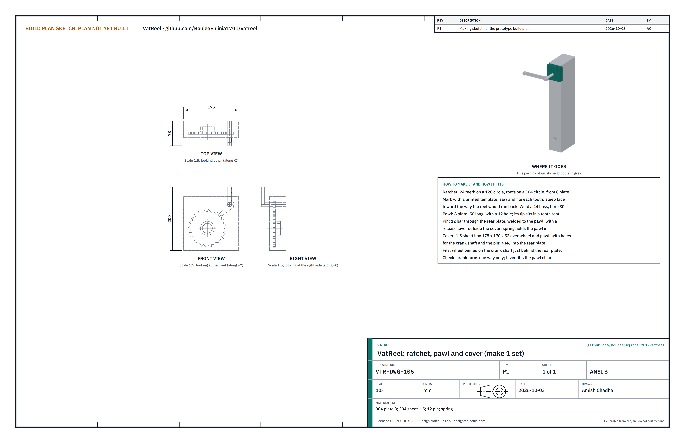

*Figure 8. Ratchet, pawl and cover making sketch (VTR-DWG-105).*

**What it is and what it is made from.** The brake that holds the reel. A 24-tooth wheel 120 over the tips from 8 mm 304 plate, a pawl of the same plate on a 12 pin, a spring, and a 1.5 mm sheet cover.

**How to make it.**

1. Print a tooth template (roots on a 104 circle, tips on 120), glue it on the plate, saw and file each tooth with its steep face toward the way the reel would run back. Weld a 44 boss and bore it 30.
2. Make the pawl 50 long with a 12 hole; weld it to a 12 pin long enough to pass through the rear plate and the cover; weld a release lever on the pin's outer end.
3. Bend the cover as a box 175 x 170 x 52 with holes for the crank shaft and the pawl pin; drill four M6 holes into the rear plate.

**How it fits the parts next to it.**

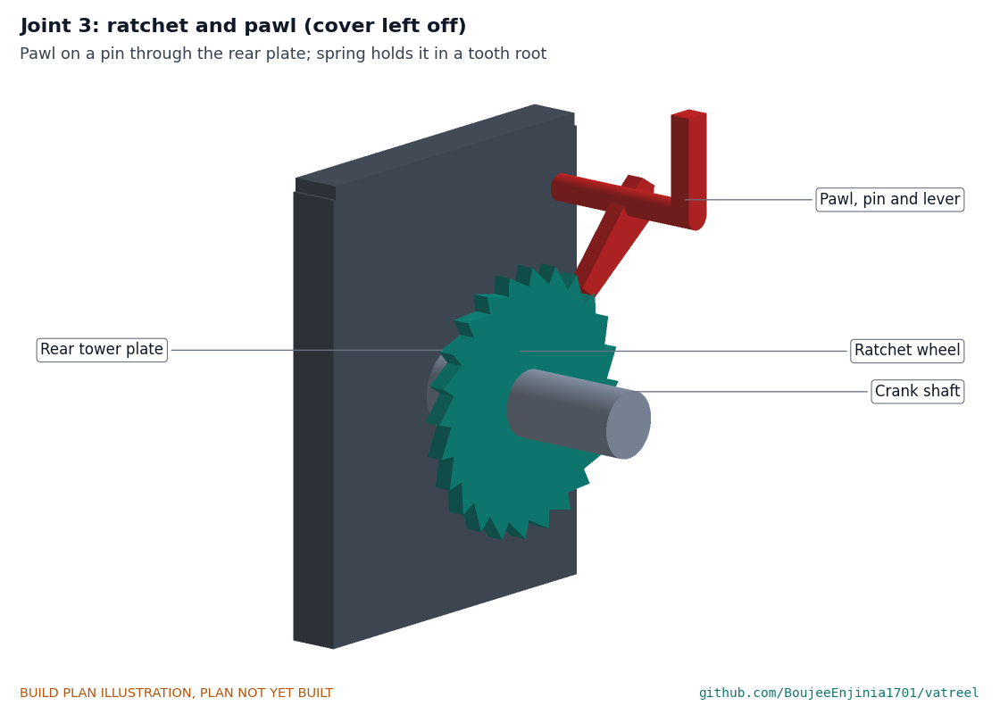

*Figure 9. Joint 3. The pawl pivots on its pin through the rear plate; the spring holds its tip in a tooth root.*

**Check before moving on.** The crank turns one way only; lifting the release lever lets it turn back.

### 3.6 Splash shield

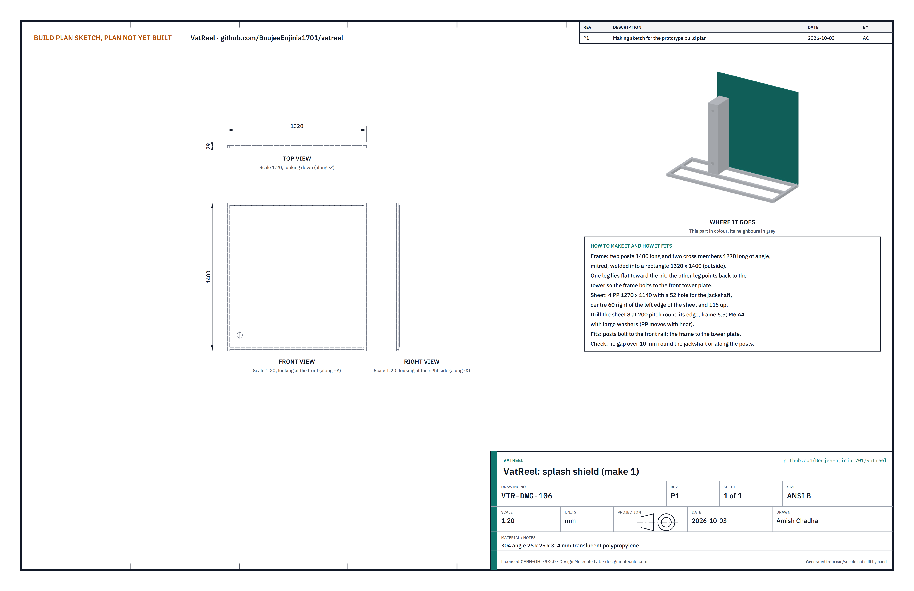

*Figure 10. Splash shield making sketch (VTR-DWG-106).*

**What it is and what it is made from.** A clear barrier between the reel and the operator. A rectangle of 25 x 25 x 3 304 angle, 1,320 wide and 1,400 high outside, and a 4 mm translucent polypropylene sheet 1,270 x 1,140.

**How to make it.**

1. Saw two posts 1,400 and two cross members 1,270; mitre and weld into a rectangle, one leg of each angle flat toward the pit and the other leg pointing back to the tower.
2. Cut the sheet; cut a 52 hole for the jackshaft, centred 60 in from the sheet's left edge and 115 up from its bottom edge (check against the tower before cutting).
3. Drill the sheet 8 at 200 pitch round its edge and the frame 6.5; fix with M6 A4 bolts and large washers so the sheet can move with heat.

**How it fits the parts next to it.**

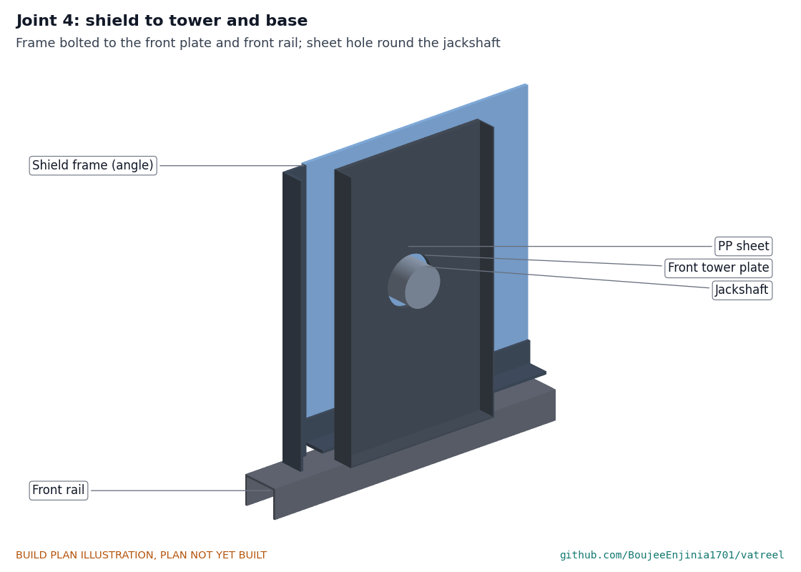

*Figure 11. Joint 4. The frame bolts to the front tower plate and to the front rail; the sheet's hole clears the jackshaft.*

**Check before moving on.** No gap wider than 10 mm round the jackshaft or along the posts.

### 3.7 Lift screw bracket

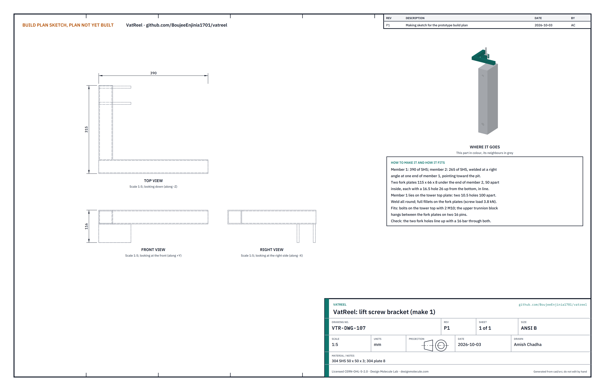

*Figure 12. Lift screw bracket making sketch (VTR-DWG-107).*

**What it is and what it is made from.** An L of 50 x 50 x 3 304 tube that reaches from the tower top out over the pit's end, with two 8 mm fork plates that hold the upper trunnion.

**How to make it.**

1. Saw a 390 and a 265 length; weld them at a right angle.
2. Weld the two fork plates (115 x 66 x 8) under the end of the short member, 50 apart inside; drill both 16.5 together, 26 up from their lower edge.
3. Drill two 10.5 holes 100 apart in the long member for the tower top.
4. Weld all round with full fillets; the screw pushes up on this bracket with up to 3.8 kN.

**How it fits the parts next to it.** The long member bolts on the tower top with two M10; the upper trunnion hangs between the forks on two pins (Figure 28).

**Check before moving on.** A 16 bar passes through both fork holes.

### 3.8 Trunnion blocks

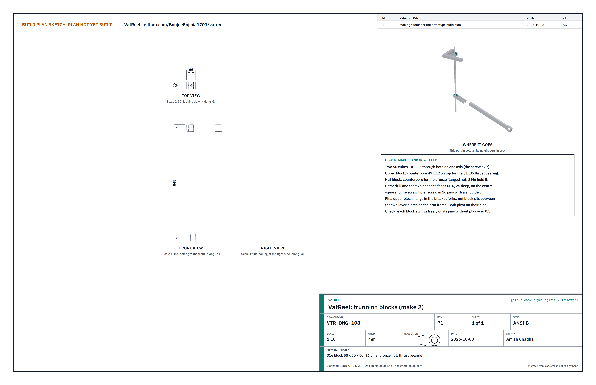

*Figure 13. Trunnion blocks making sketch (VTR-DWG-108).*

**What it is and what it is made from.** Two 50 mm 316 cubes. The upper block carries the screw in a thrust ball bearing; the lower block holds the bronze nut between the lever plates on the arm frame.

**How to make it.**

1. Drill 25 through each cube for the screw.
2. Upper block: counterbore 47 x 12 on top for the 51105 thrust bearing. Nut block: counterbore for the nut's flange; two M6 hold the nut.
3. On two opposite faces of each block, square to the screw hole, drill and tap M16 25 deep; screw in 16 pins with a shoulder.

**How it fits the parts next to it.** Each block pivots on its two pins; the screw turns in the upper bearing and the bronze nut.

**Check before moving on.** Each block swings on its pins with no more than 0.5 of play.

### 3.9 Pivot tube with plug

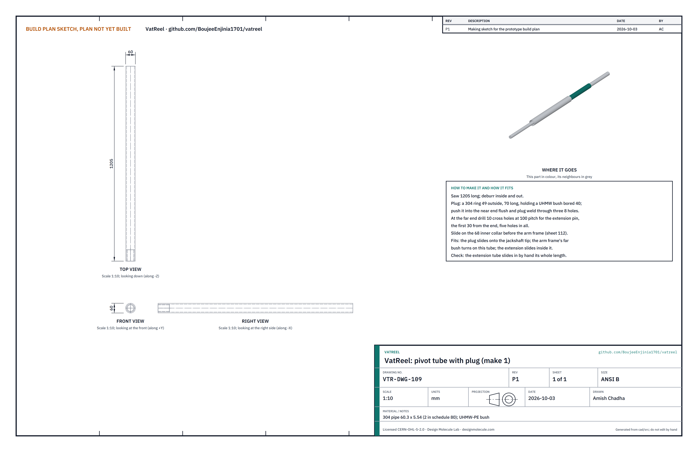

*Figure 14. Pivot tube making sketch (VTR-DWG-109).*

**What it is and what it is made from.** The tube the arm frame swings on. 304 pipe 60.3 x 5.54 (2 inch schedule 80), 1,205 long, with a plug and UHMW-PE bush bored 40 in its near end.

**How to make it.**

1. Saw and deburr inside and out.
2. Push the plug ring with its bush into the near end, flush; plug weld through three 8 holes.
3. Drill five 10 cross holes at 100 pitch for the extension pin, the first 30 from the far end.
4. Slide the inner shaft collar (68) onto the tube before the arm frame goes on.

**How it fits the parts next to it.**

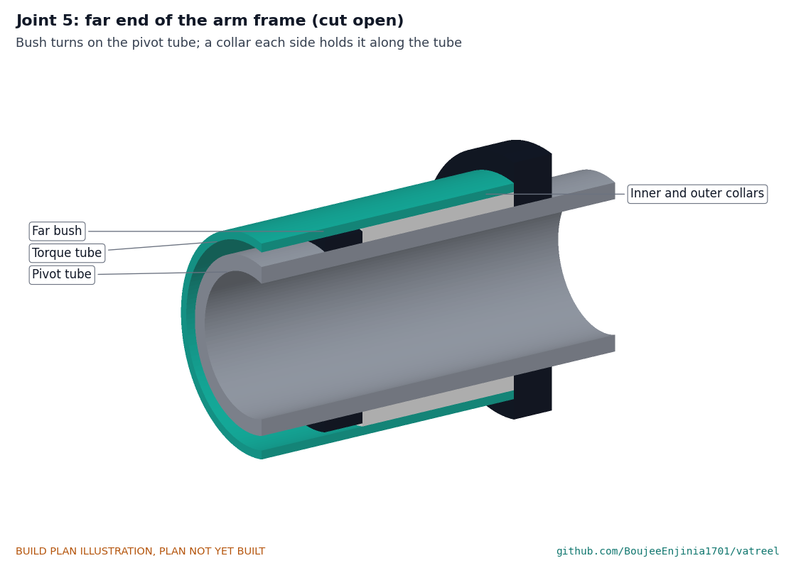

*Figure 15. Joint 5. The far bush turns on the pivot tube; a collar on each side holds it along the tube.*

**Check before moving on.** The extension tube slides inside by hand its whole length.

### 3.10 Extension tube

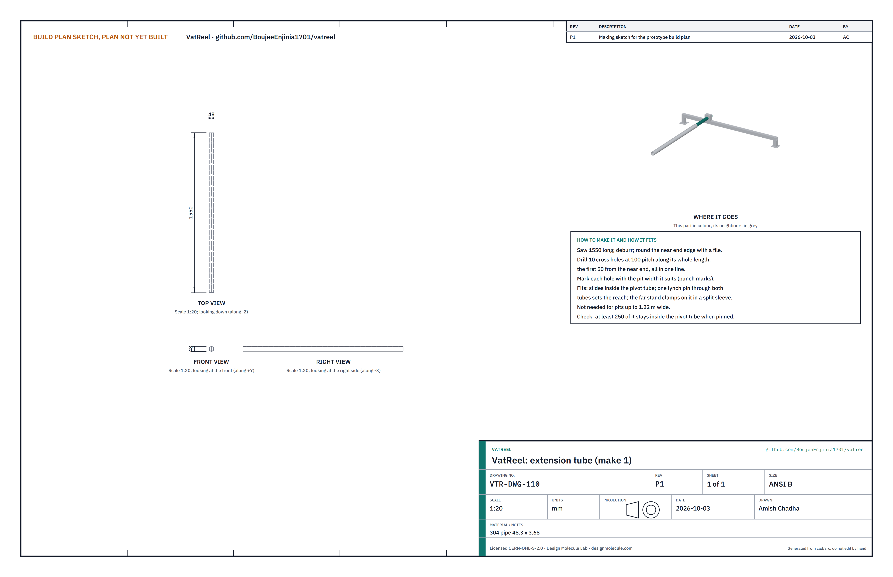

*Figure 16. Extension tube making sketch (VTR-DWG-110).*

**What it is and what it is made from.** 304 pipe 48.3 x 3.68, 1,550 long, with a 10 lynch pin on a lanyard. Needed only for pits wider than 1.22 m.

**How to make it.**

1. Saw, deburr and round the near end edge with a file.
2. Drill 10 cross holes at 100 pitch along its length, the first 50 from the near end, in one line.
3. Punch-mark each hole with the pit width it suits.

**How it fits the parts next to it.**

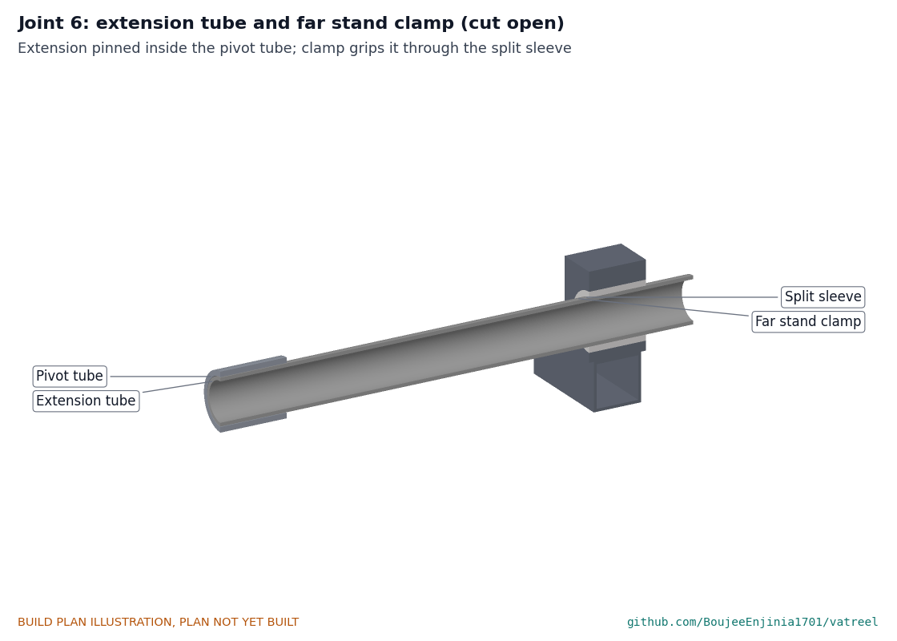

*Figure 17. Joint 6. The extension is pinned inside the pivot tube; the far stand's clamp grips it through the split sleeve.*

**Check before moving on.** When pinned, at least 250 of it stays inside the pivot tube.

### 3.11 Far stand

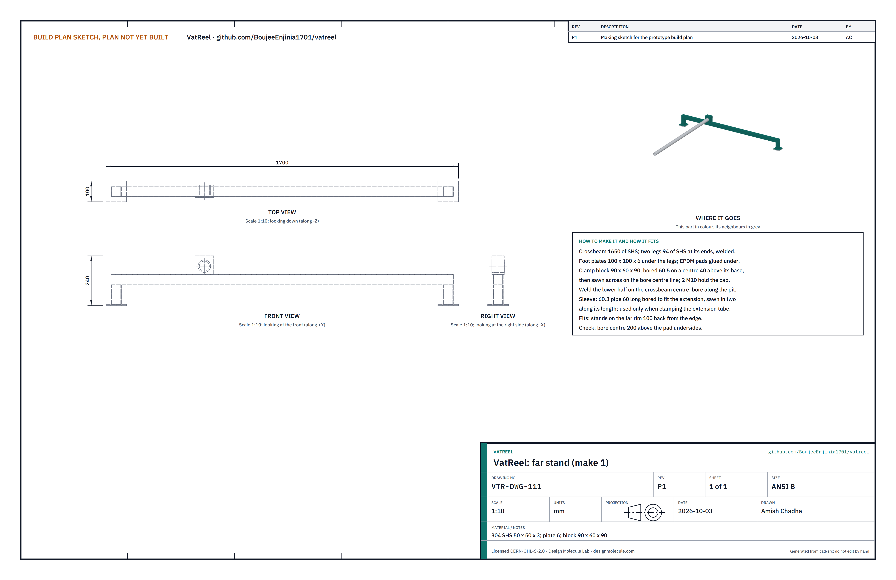

*Figure 18. Far stand making sketch (VTR-DWG-111).*

**What it is and what it is made from.** A beam on two short legs that stands on the far rim and clamps the end of the tube. 304 tube 50 x 50 x 3, 6 mm foot plates, a 90 x 60 x 90 clamp block, a split sleeve and two EPDM pads.

**How to make it.**

1. Saw the crossbeam 1,650 and two legs 94; weld the legs under the ends and the foot plates under the legs.
2. Bore the clamp block 60.5 with the bore centre 40 above its base; saw it across on the bore centre line; drill and tap for two M10 to hold the cap.
3. Weld the lower half on the middle of the beam, bore along the pit's width.
4. Saw a 60 length of 60.3 pipe, bore it to fit the extension and saw it in two along its length (the sleeve).

**How it fits the parts next to it.** The clamp closes on the pivot tube directly, or on the extension through the sleeve (Figure 17).

**Check before moving on.** The bore centre is 200 above the underside of the pads.

### 3.12 Arm frame

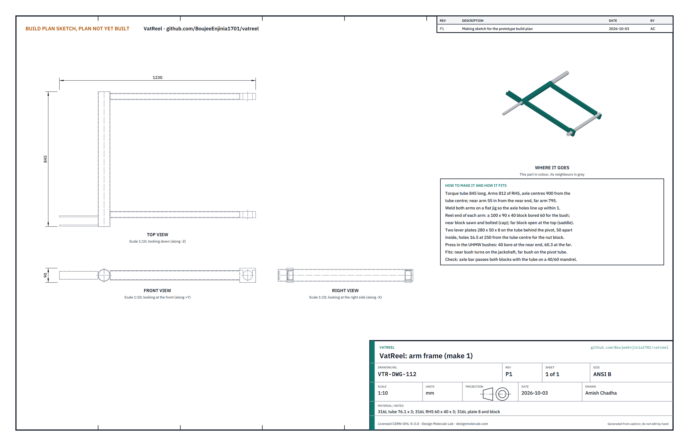

*Figure 19. Arm frame making sketch (VTR-DWG-112), drawn with the arms level.*

**What it is and what it is made from.** The welded U that carries the reel: a 316L torque tube 76.1 x 3, 845 long, two arms of 316L rectangular tube 60 x 40 x 3, a split bearing block on the near arm and an open saddle on the far arm, two lever plates, and a keeper.

**How to make it.**

1. Saw the torque tube and two arms 812 long.
2. Make a flat jig that holds the torque tube and puts the two bearing centres 900 from the tube centre, in line. Near arm 55 in from the tube's near end, far arm 795 in.
3. Weld a 100 x 90 x 40 block on the reel end of each arm and bore both 60 in line with the jig. Saw the near block across its centre and drill it for two M8 cap bolts. On the far block cut a 60 slot from the top down to the bore centre (the saddle).
4. Weld two lever plates (280 x 50 x 8) on the torque tube on the side away from the arms, 50 apart inside; drill 16.5 holes at 250 from the tube centre for the nut block.
5. Make the keeper (80 x 40 x 8 plate) hinged on one side of the saddle, closing over the slot, with a pin hole on the other side.
6. Press the UHMW-PE bushes into the torque tube: bore 40 at the near end, 60.3 at the far end. Pickle all welds.

**How it fits the parts next to it.** The near bush turns on the jackshaft and the far bush on the pivot tube (Figures 6 and 15); the nut block sits between the lever plates (Figure 27).

**Check before moving on.** A straight bar passes through both bearing blocks with the frame on a 40 and 60 mm stepped mandrel.

### 3.13 Chain 2 guard

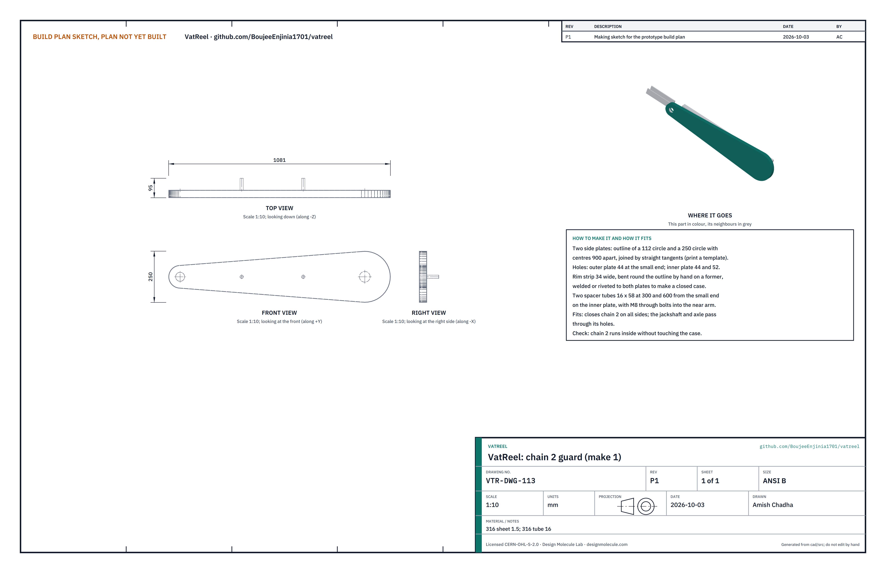

*Figure 20. Chain 2 guard making sketch (VTR-DWG-113).*

**What it is and what it is made from.** A closed case of 1.5 mm 316 sheet round chain 2.

**How to make it.**

1. Print a template: a 112 circle and a 250 circle with centres 900 apart, joined by straight tangent lines. Cut two side plates.
2. Holes: 44 at the small end of both plates; 52 at the large end of the inner plate only.
3. Bend a 34 wide strip round the outline on a plywood former; weld or rivet it to both plates.
4. Weld two spacer tubes 16 x 58 on the inner plate at 300 and 600 from the small end; drill for M8 through bolts.

**How it fits the parts next to it.** It bolts to the near arm on the spacers; the jackshaft and the axle pass through its holes (Figure 22).

**Check before moving on.** Chain 2, joined loosely inside, does not touch the case.

### 3.14 Reel

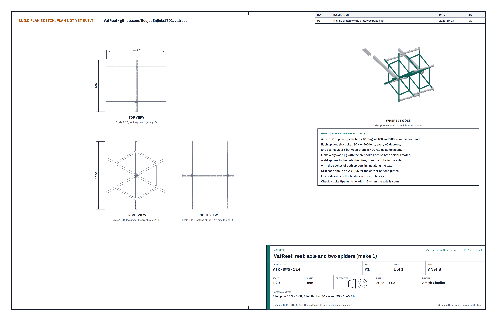

*Figure 21. Reel making sketch (VTR-DWG-114), drawn with the axle level.*

**What it is and what it is made from.** A 316L axle 48.3 x 3.68, 900 long, with two spiders, each six 30 x 6 spokes 560 long on a 40 long hub sleeve, braced by six 25 x 6 ties at 420 radius.

**How to make it.**

1. Make a plywood jig with six spoke lines at 60 degrees and a centre peg for the hub sleeve.
2. For each spider, weld the six spokes to a hub sleeve in the jig, then the six ties between the spokes.
3. Slide both spiders on the axle, 180 and 780 from its near end, with the spokes of both in line along the axle (check with a straight edge); weld the hubs to the axle.
4. Drill each spoke tip 2 x 10.5 for the carrier bar end plates. Pickle all welds.

**How it fits the parts next to it.**

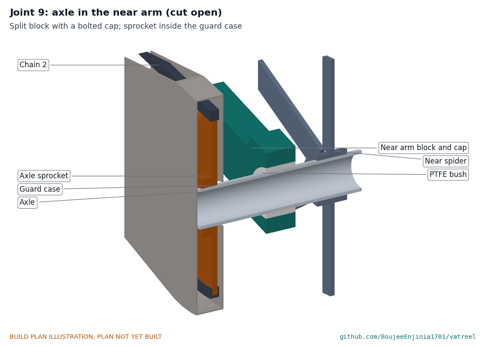

*Figure 22. Joint 9. The axle turns in a glass-filled PTFE bush in the split block; the axle sprocket sits inside the guard case on the wall side.*

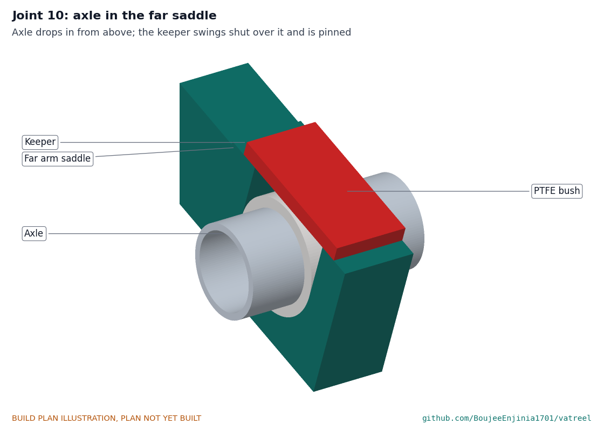

*Figure 23. Joint 10. The axle drops into the open saddle from above; the keeper swings shut over it and is pinned.*

**Check before moving on.** Spun on its axle, the spoke tips run true within 5.

### 3.15 Carrier bars (make 6)

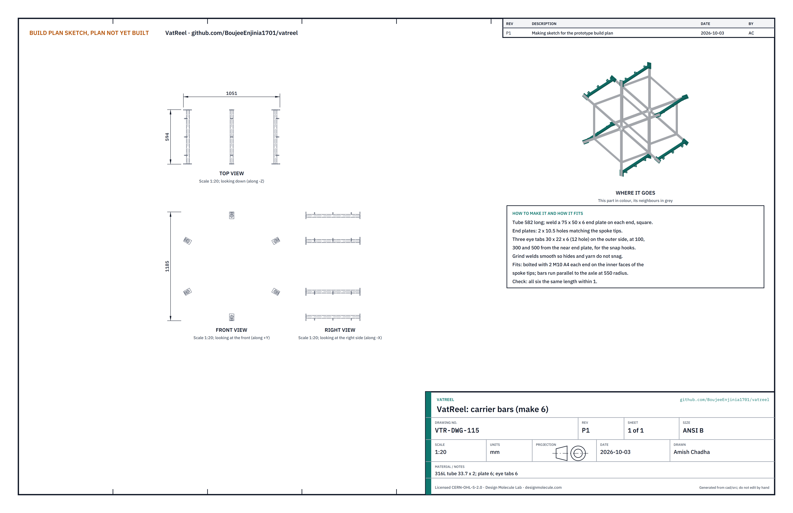

*Figure 24. Carrier bar making sketch (VTR-DWG-115).*

**What it is and what it is made from.** 316L tube 33.7 x 2, 582 long, with a 75 x 50 x 6 end plate on each end and three eye tabs for snap hooks.

**How to make it.**

1. Saw six tubes to the same length within 1; weld the end plates square.
2. Drill each end plate 2 x 10.5 to match the spoke tips.
3. Weld three eye tabs (30 x 22 x 6, 12 hole) on the outer side at 100, 300 and 500 from the near end plate.
4. Grind every weld smooth so hides and yarn do not snag; pickle.

**How it fits the parts next to it.**

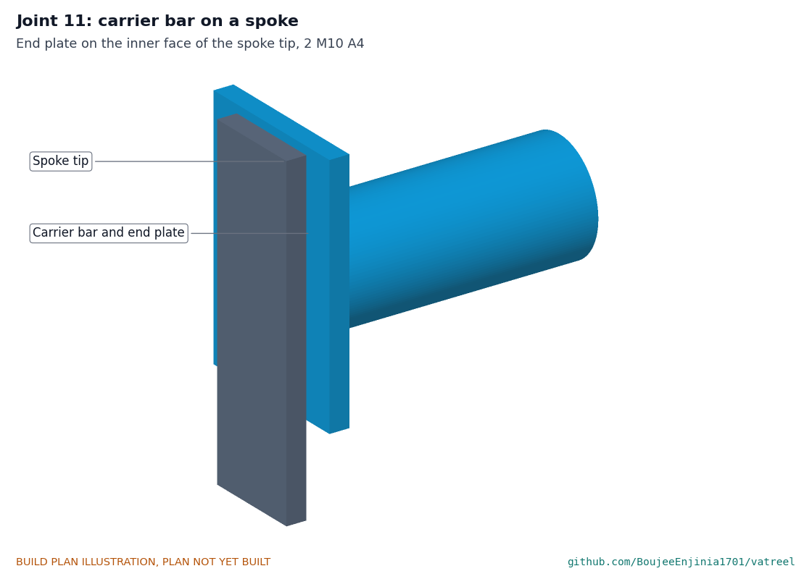

*Figure 25. Joint 11. Each end plate bolts to the inner face of a spoke tip with two M10 A4.*

**Check before moving on.** All six bars are parallel to the axle and the reel still runs true.

### 3.16 Loading hooks (make 2)

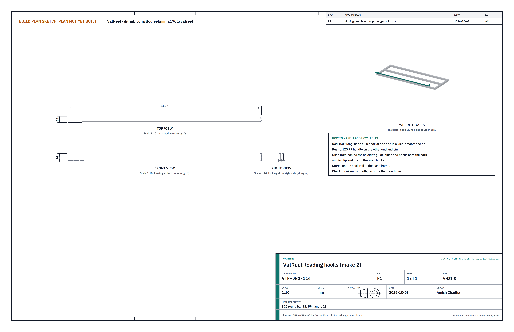

*Figure 26. Loading hook making sketch (VTR-DWG-116).*

**What it is and what it is made from.** 12 mm 316 rod 1,500 long with a 60 mm hook and a polypropylene handle.

**How to make it.** Bend the hook in a vice and smooth the tip; push on and pin the handle.

**How it fits the parts next to it.** Used from behind the shield to guide hides and hanks and to clip snap hooks; kept on the base frame's back rail.

**Check before moving on.** No burrs on the hook.

### 3.17 Lift screw (bought)

**What to buy.** Tr24 x 5 single-start threaded rod in 316 stainless (2 m, cut to 1,250); a bronze Tr24 x 5 flanged nut; a 51105 stainless thrust ball bearing; a 250 mm handwheel with a spinner.

**What to do to it.** Saw the rod to 1,250. Buy the handwheel with a 24 bore so it fits the rod as it is; drill 6 through the handwheel hub and rod; roll pin. Run the nut along the whole thread by hand before fitting.

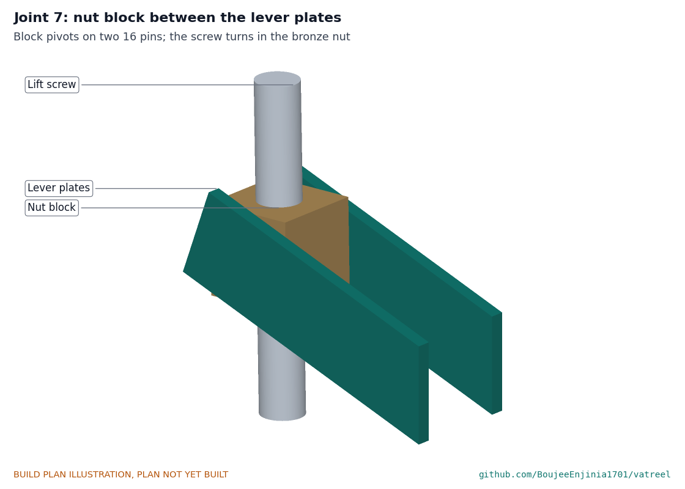

*Figure 27. Joint 7. The nut block pivots between the lever plates; the screw turns in the bronze nut.*

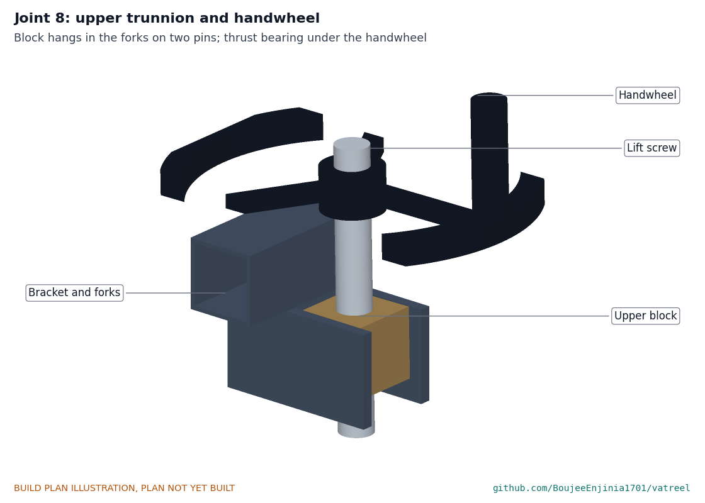

*Figure 28. Joint 8. The upper block hangs in the forks on two pins; the thrust bearing sits under the handwheel.*

### 3.18 Drive parts, bushes and fixings (bought)

**What to buy.** ISO 606 08B-1 plate sprockets with hubs: 15 teeth bored 30 and 30 teeth bored 40 (plated steel, inside the tower); 17 teeth bored 40 and 51 teeth bored 48.3 (304 stainless, on the arm). Chain 1, plated steel, about 1.9 m; chain 2, 304 stainless, about 2.3 m, with connecting links. Four flanged UHMW-PE bushes for the tower (two 40 bore, two 30 bore); UHMW-PE bushes for the torque tube (40 x 70 and 60.3 x 70); two split glass-filled PTFE bushes 48.3 x 60 x 40 for the axle. Two split shaft collars (68 and 90 outside, 60.3 bore). Eighteen 316 snap hooks. A4 bolts, roll pins, R-clips. Six EPDM pads. A 3.6 m steel pipe 33.7 x 3.2 (the assembly bar).

**What to do to them.** Drill each sprocket hub 6 for its roll pin together with its shaft (section 3.3). Cut chains to length when fitted. Ream bushes lightly if a shaft does not turn by hand.

## 4. Putting it together

Two people, working only from the rims. Fit over an empty pit or a water-filled test tank first.

### Step 1: base frame on the near rim

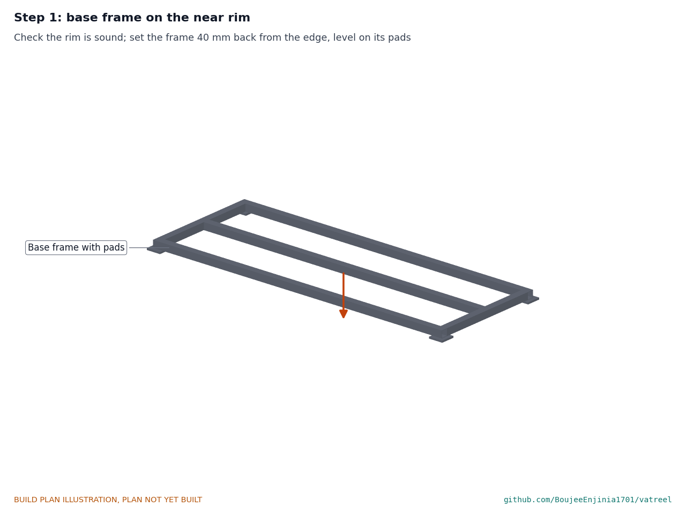

Check the rim is sound and level. Set the frame 40 back from the pit edge, its left end 550 past the pivot position (the pivot line is 350 in from the pit's end wall). Pack pads to level it.

### Step 2: tower and braces

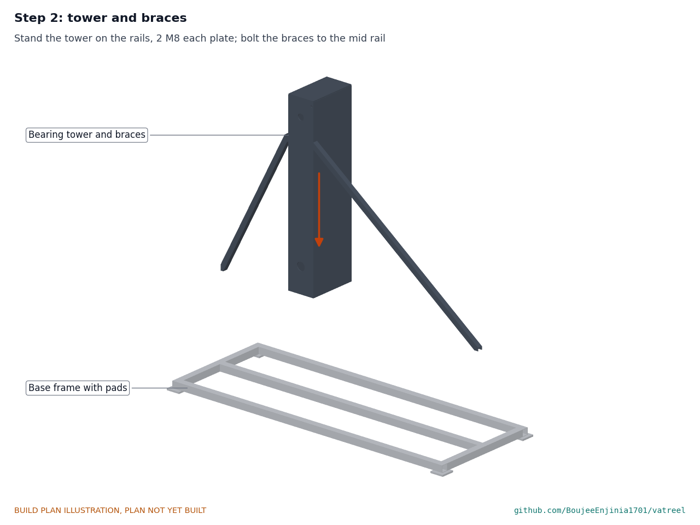

Stand the tower on the front and mid rails, two M8 per plate. Bolt the braces from the tower sides to the mid rail ends.

### Step 3: shafts, bushes, sprockets and chain 1

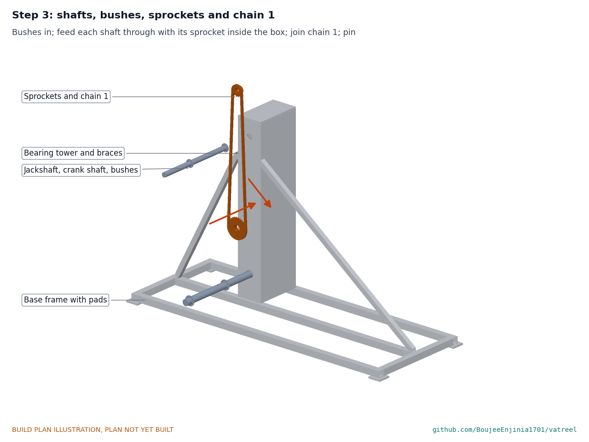

Push the four flanged bushes into the tower plates. Feed the jackshaft in from the back, threading the large chain 1 sprocket onto it inside the box; feed the crank shaft the same way with the small sprocket. Join chain 1 round both; pin both sprockets. Slide the chain 2 sprocket onto the jackshaft tip and pin it.

### Step 4: ratchet, pawl, cover and crank

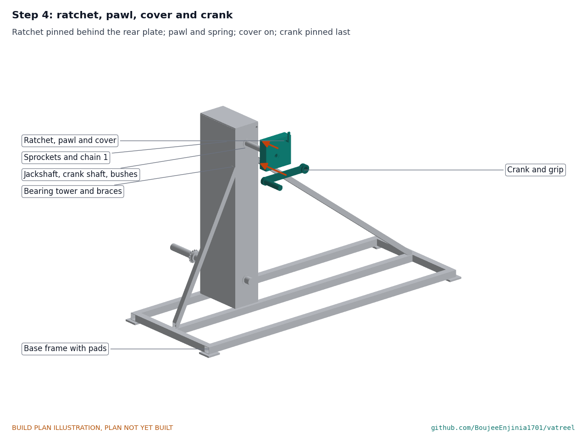

Pin the ratchet wheel on the crank shaft just behind the rear plate. Fit the pawl pin through the rear plate with its spring; bolt on the cover; fit the release lever. Pin the crank on last.

### Step 5: splash shield

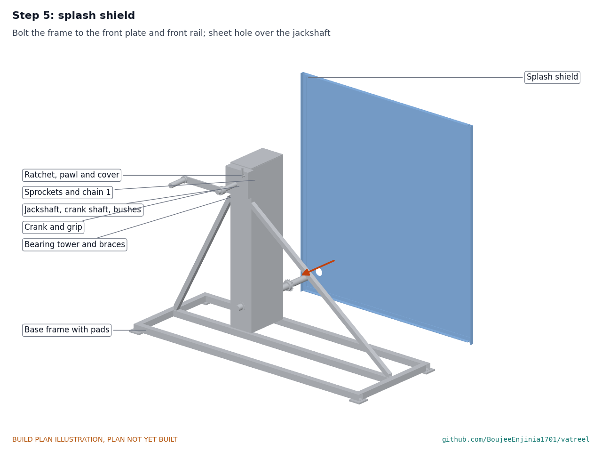

Bolt the shield frame to the front tower plate and to the front rail; the sheet's hole goes over the jackshaft.

### Step 6: far stand on the far rim

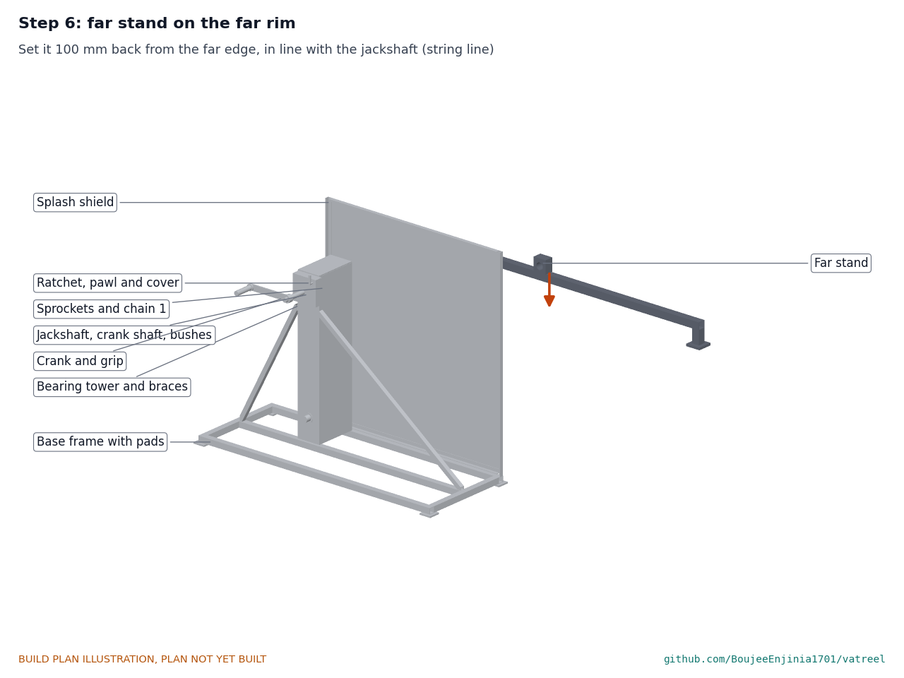

Stretch a string from the jackshaft square across the pit; set the far stand on the far rim 100 back from the edge with its clamp on the string line. Open the clamp cap.

### Step 7: pivot tube and arm frame onto the jackshaft

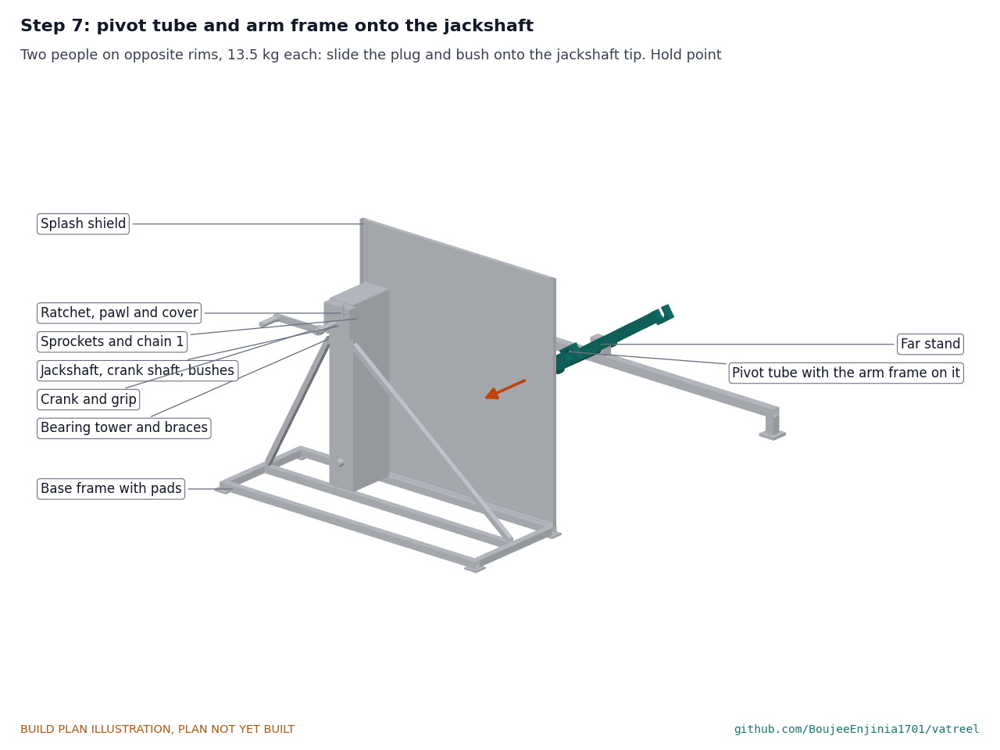

Off the pit, slide the inner collar onto the pivot tube, then the arm frame (its far bush onto the tube from the far end), then the outer collar; tighten both collars. Two people, one on each rim, carry the tube and frame across (13.5 kg each) with the arms tied up to the tube, and slide the frame's near bush and the tube's plug onto the jackshaft tip. **Hold point:** the arms stay tied until the lift screw is fitted.

### Step 8: extension tube and far clamp

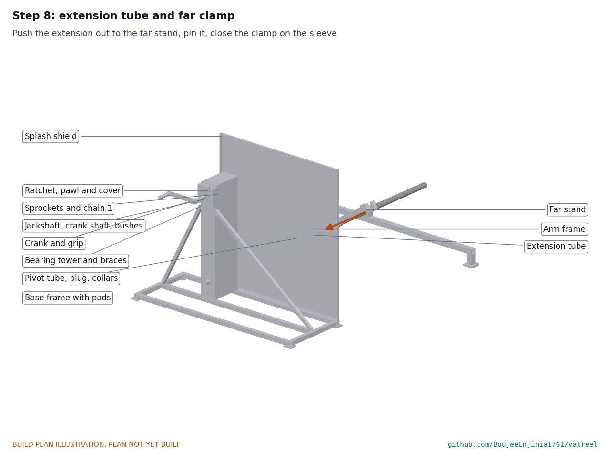

For pits wider than 1.22 m, push the extension out of the pivot tube to the far stand and put the lynch pin through the hole marked for this pit. Close the clamp cap on the tube (with the split sleeve on the extension).

### Step 9: bracket and lift screw

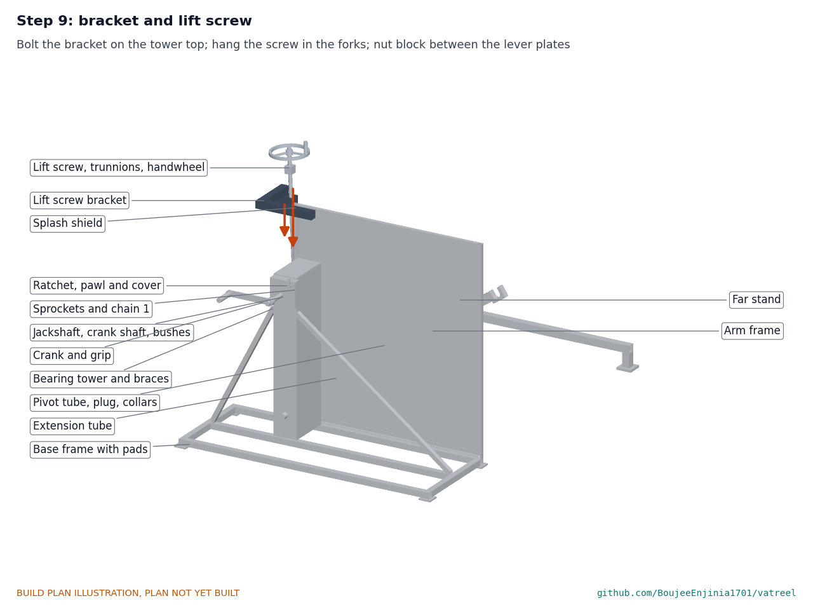

Bolt the bracket on the tower top. Hang the upper trunnion in the forks; put the nut block between the lever plates with its pins. Untie the arms and wind the handwheel until the arms are fully raised.

### Step 10: reel onto the raised arms

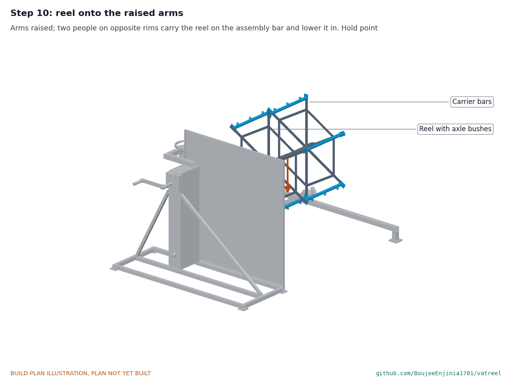

Push the assembly bar through the reel's hollow axle. One person on each rim lifts the bar (about 15 kg each) and lowers the axle into the near split block (cap off) and the far saddle (keeper open). **Hold point:** both ends seated before anyone lets go of the bar.

### Step 11: keeper, near cap, axle sprocket and chain 2

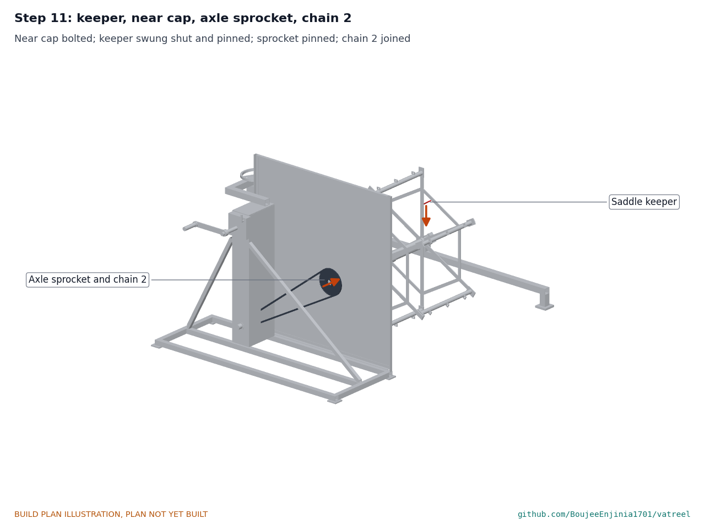

Close the keeper over the far end of the axle with the loading hook and pin it from the far rim. Bolt the near cap. Pin the axle sprocket on the axle's near end; join chain 2 round both chain 2 sprockets. Withdraw the assembly bar.

### Step 12: chain 2 guard

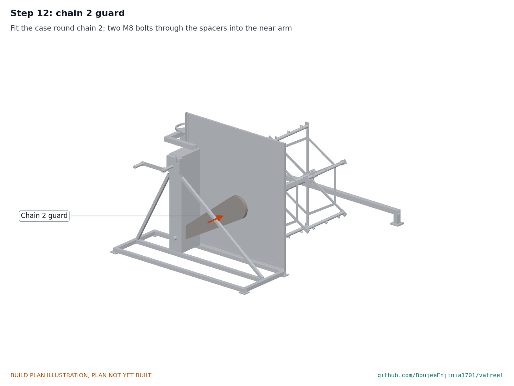

Fit the case round chain 2 (open the rim strip joint if it is bolted) and fix it to the near arm with two M8 through the spacers.

### Step 13: lower to the working depth; hooks on the base

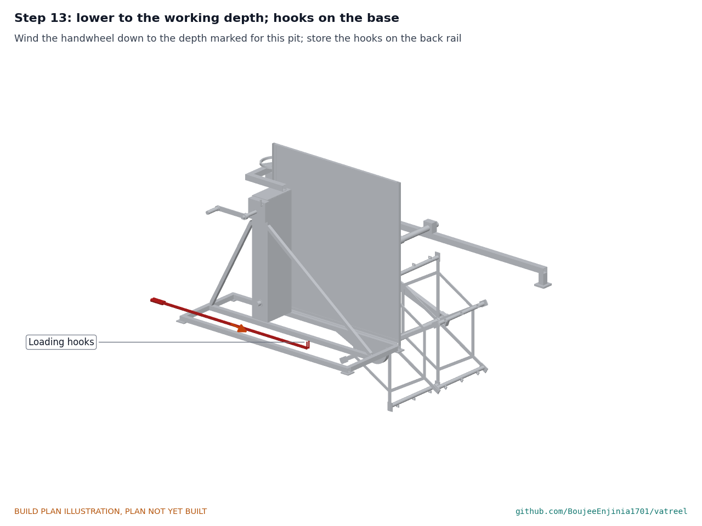

Wind the handwheel down to the depth marked for this pit. Hang the snap hooks on the carrier bar eyes and store the loading hooks on the back rail.

## 5. First checks

These are listed for the TRL 4 build; a test report records them.

*Table 2. First checks.*

| Check | Requirement | How | Pass when |
| --- | --- | --- | --- |
| Fit across the pit | R3 | Set up over pits (or frames) 1.0 and 2.5 m wide | Both stands flat on the rims, tube pinned with 250 overlap |
| Depth range | R4 | Measure the lowest bar below the rim at the handwheel's ends of travel | 300 or less and 1,000 or more |
| Lift | R11 | Wind fully up; let go of the handwheel loaded with 1.5 x | Every bar above the rim; no creep in 10 min |
| Crank force | R2 | Spring balance on the grip, 25 kg of wet sandbags on one bar, over water | 100 N or less |
| Holding | R5 | 1.5 x load on one bar, crank released | No slip at the ratchet |
| Hands out of liquor | R1 | Load and unload a batch with the hooks only | No hand below the rim |
| Splash | R9 | Indicator paper on the operator's apron, normal cranking | No marks |
| Guarding | R12 | Competent person checks every opening near the chains, ratchet and screw | Meets ISO 13857 |
| Mass and setup | R8 | Weigh each module; time a two-person setup | Recorded against the targets |

## 6. Safety stops

Work stops at each point below until what is listed is true.

1. **Before placing anything on a rim:** the rim is checked sound and dry, and the floor round it is clear. Both people wear gloves, eye protection and boots.
2. **Before any lift over the pit (steps 7 and 10):** two people, one on each rim, have agreed the lift; nobody stands on boards or the frame over the pit; the pit is empty or the liquor is cold.
3. **Before letting go of the arm frame (step 9):** the lift screw is fitted and the nut block pinned; until then the arms stay tied up.
4. **Before letting go of the reel (step 10):** the axle is seated in both bearings; then the keeper is pinned and the cap bolted.
5. **Before the first turn of the crank:** the chain 1 box, the ratchet cover and the chain 2 case are closed; the shield is on; nobody is on the far rim within reach of the reel.
6. **Before the first load:** the reel has turned ten times empty and the ratchet holds; the first loads are water and sandbags in a test tank, not liquor.
7. **Before working in liquor:** the R5 holding check and the R12 guarding check are passed (TRL 4).
8. **Before a hot bath (above 60 °C):** two people are present; the shield is on; loads go on and off only at the top of the reel with the hooks.
9. **Before reaching toward the reel for any reason:** the reel is stopped, the ratchet is engaged and the arms are wound up.

## 7. Tools, skills and workspace

- **Tools:** metal-cutting saw or cut-off saw, angle grinder with cutting and flap discs, pillar drill and hand drill with 6 to 25 mm bits and a 50 hole saw, taps M6 to M16, files, vice, spanners, TIG or stick welder for stainless with 316L filler, pickling paste, spring balance, tape, square and string line.
- **Skills:** stainless welding with clean, full fillets; drilling holes in line through two parts; reading the making sketches.
- **Workspace:** a flat floor for the jigs; ventilation or extraction for stainless weld fume; a water-filled test tank or empty pit for first assembly.

## 8. Where the numbers come from

- Model: `cad/src/model.py` (fit checks: `python cad/src/model.py --check`)
- General arrangement: `cad/drawings/VTR-DWG-001`; making sketches `cad/drawings/VTR-DWG-101` to `VTR-DWG-116`
- Calculation note: `docs/04-calcs/01-sizing.md` (VTR-CAL-001) and `docs/04-calcs/sizing.py`
- Bill of materials: `bom/bom.csv`
- Pictures: `cad/src/build_plan_media.py`
- Decisions: `docs/decisions/0001-trl2-review-decisions.md`, `docs/decisions/0002-design-for-construction.md`
